# JavaScript and Python

Student ID: 13508159

Student’s name: Quang Thanh Dao

Course: SDV602

## Heritage and Philosophy

### JavaScript

According to Wikipedia, JavaScript is a high-level and multi-paradigm language. Alongside HTML and CSS, JavaScript is one of the core technologies of the World Wide Web and with the developments, the language also become core components fo many software system, most notably servers and a variety of  applications.

In 1995, under the management of Netscape, Brendan Eich devised a new language with syntax similar to Java and less like Scheme or other extant scripting languages. The language first called LiveScript when first shipped as part of a Navigator beta in September 1995 but changed into JavaScript afterward during the official release in December 1995. The language was later submitted to Ecma International for a standard specification that all browser vendors could conform to but during that time, Microsoft with JScript reach 95% of market share for internet browser. The rise of JavaScript start with Mozilla, successor of Netscape, releasing Firefox browser which taking significant market share from Internet Explorer.

It is important to understand before 2005, JavaScript was exclusively used for user-interface behaviour of a web page such as validate user input, adding special effect. The changes happened after Jesse James Garett released Ajax and a set of technologies for dynamic web pages with JavaScript as backbone. Afterward in 2009, 2010, the creation of node.js and express.js framework allows the creation of “server-side” application in JavaScript to be more accessible.

Lastly, according to Adam, JavaScript’s philosophy can be considered as a moving target with Eich ‘s original philosophy is composability and relatively simple while Ecma’s committee-led direction for JavaScript is all things to all people.

### Python

According to Wikipedia, Python is an interpreted high-level general-purpose programming language. Its design philosophy emphasises code readability and language contructs as well as its object-oriented approach help programmers write clear, logical code.

The creation of Python started since late 1980s by Dutch programmer Guido van Rossum and was first release in 1991. The language is created for the purpose of succession the fail programming language ABA. The coding language is simple and innovative which allow the revolutionise of global programming community. It was used as scripting language by Amoeba and a  distributed operating system used by Centrum Wiskunde & informatica(CWI).

According to Adam, despite its slow start, Python had a small but devoted community with many core developers ( Pythoneer). The programming language started to gain momentum after 2004 by Google’s acquisition of YouTube and its adoption of Python.

The Zen of Python from [python.org](https://www.python.org/dev/peps/pep-0020/):

> Beautiful is better than ugly.
> Explicit is better than implicit.
> Simple is better than complex.
> Complex is better than complicated.
> Flat is better than nested.
> Sparse is better than dense.
> Readability counts.
> Special cases aren't special enough to break the rules.
> Although practicality beats purity.
> Errors should never pass silently.
> Unless explicitly silenced.
> In the face of ambiguity, refuse the temptation to guess.
> There should be one-- and preferably only one --obvious way to do it.
> Although that way may not be obvious at first unless you're Dutch.
> Now is better than never.
> Although never is often better than *right* now.
> If the implementation is hard to explain, it's a bad idea.
> If the implementation is easy to explain, it may be a good idea.
> Namespaces are one honking great idea -- let's do more of those!

This perfectly sum up van Rossum’s philosophy for Python to be extreme sparse and uphold aesthetics as well as readability so there is no room for “ugliness and ambiguity”.

## Platform for developing

### Visual Studio Code

Visual Studio Code or Vs code is a product of Microsoft and it can operate on Linux and MacOS system. While initially created for web development, Vs code group and support over 30 programming language as of now. The IDE also come with IntelliSense feature like Visual Studio which enable developers to code fast with code suggestions, hint and parameter description. Furthermore, Vs code also come with first-rate debugger for JavaScript and Node.js application while other languages debugger extension also included in the marketplace. Lastly,  The IDE is supported with large community and a huge range of extension which allow developers to tailor Vs code to accommodate their needs. The IDE can be used to code both Python and JavaScript.

According to dev.to, here are the pros and cons of Atom:

**Pros:**

- Powerful multilanguage IDE
- Nice built-in features like auto-highlighting repeating variables
- It's lightweight
- Helpful for quick script modification
- Better UI, easy plugins, and nice git integration

**Cons:**

- More advanced debugging features would be helpful
- Including a built-in screen for package management
- Its user interface is really intimidating to new and beginner users

### Atom

Atom is a free and open-source code editor for macOS, Linux and Microsoft Windows with support for plug-ins written in Node.js, and embedded Git Control. The code editor can be supported with plug-ins to suit the development needs and programming languages such as JavaScript and Python. Moreover, similar with Vs Code, Atom is highly customisable with themes and extensions for code hinting or clean up and the options is endless due the fact Atom is open-source.  The IDE can be used to code both Python and JavaScript.

According to dev.to, here are the pros and cons of Atom:

**Pros:**

- Git Integration
- Cross-Platform Support
- Multi cursor support

**Cons:**

- Sometimes unstable
- Lack of Code Execution
- Slower than other top editors

### PyCharm

According to dev.to, PyCharm is one of the highest rated Python IDEs with its suite of productivity tools and features. On another hand, different licenses offer different degrees of functionality.

- Apache-licensed PyCharm community version which aimed mostly at data scientist
- Education edition which provide free access to students and teachers
- Professional edition which cost between $159 to $199 for annual subscription for business.

The paid version of PyCharm offers advanced features and capabilities geared toward streamlining all aspects of professional Python software development.

Here are the pros and cons of PyCharm: 

**Pros**

- All-in-one IDE out-of-the-box – write, edit, debug, compile, execute and deploy from the same window
- Created specifically for Python developers
- Django support (including code completion and resolution in views.py and urls.py files, code inspection tools for Django ORM, and the ability to debug Django templates)
- Professional support by JetBrains
- Compatible with over 3,000 available Intellij plugins

**Cons**

- Price of professional edition (and lack of features in free editions)
- Requires some configuration for first-time users and novices
- Supports a limited number of languages and technologies in addition to Python
- System requirements and performance – consumes up to 1GB of memory a minute while idle

## Code Libraries

### NPM

According to [docs.npmjs.com](https://docs.npmjs.com/about-npm), npm is the world’s largest software registry and the default package manager for JavaScript runtime environment Nodejs .Open source developers use npm to share and borrow packages, and many organisations use npm to manage private development.

According to Wikipedia, npm was first released in 2010 and is written entirely in JavaScript by Isaac Z. Schlueter with the inspiration from other similar projects such as PEAR and CPAN. npm allows developers to install, and manage dependencies though the `package.json` file.  `package-lock.json` file is also provided by npm which has the entry of the exact version used by the project after evaluating semantic versioning in `package.json`. There are some open-source alternatives to npm for installing modular such as `ied`, `pnpm`, `npmd` and Yarn( released by Facebook in 2016) which provide different client-side experience and focused on improving performance.

Some commands for npm:

- check version or if pip is installed

`npm version`

- install package

`npm install mongoose`

- uninstall package

`npm uninstall pymongo`

- list installed packages

`npm ls`

### PIP

According to Wikipedia, pip is a package manager for Python packages or modules. A package contains all the files needed for a module which are Python code libraries you can include in your project. PIP connects to an online repository of public packages, called Python Package Index and it also connect to other package repositories.

pip was first known as `pyinstall` in 2008 by Ian Bicking (the creator of the virtualenv package) and later changed to pip due to the suggestions on his blog post. In 2011, Python Packaging Authority (PyPA) was created to take over the maintenance of pip and virtualenv from Bicking.

Some commands for PIP:

- check version or if pip is installed

`pip --version`

- install package

`pip install pymongo`

- uninstall package

`pip uninstall pymongo`

- list installed packages

`pip list`

## Characteristics, strength and weakness

| Elements           | Python                                                       | JavaScript                                                   |
| ------------------ | ------------------------------------------------------------ | ------------------------------------------------------------ |
| Code Blocks        | Python relies on indentation to defines code block. When a series of continuous lines of code are indented at the same level, they are considered part of the same code block. Example: 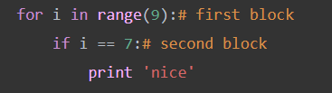 | JavaScript uses curly braces `{}` to indicate the start and finish of the code block. 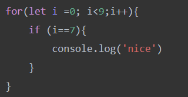 |
| Variable           | Defining a variable in Python only require the use of `=` and the value with the correct data type 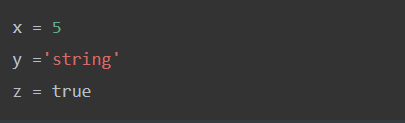 | For JavaScript, developer needs to include the keyword before the variable name 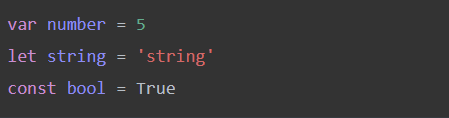 |
| Naming Conventions | According to Python style Guide(PEP8), variables names follow the same convention as functions names which should be lowercase and separate by underscores. ( `mixedCase` is allowed only if there already the prevailing style) 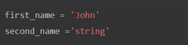 | For JavaScript, we should use the  CamelCase naming style which is the name starts with a lower case letter and then every new words starts with an uppercase letter 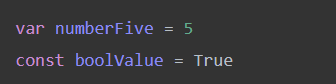 |
| Language type      | Python is both a strongly typed and a dynamically typed language which means the variable do have a type which can affect the performing operations on a variable (strong typed) while the type of the variable is determined only during runtime(dynamic typed). Example 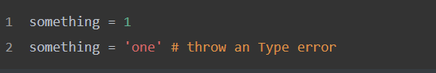 | JavaScript is weakly typed or untyped languages which means the language will figure out what type of data and make adjustment so developer can skip the task of redefine different types of data. Example 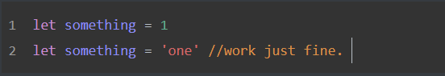 |
| Comments           | Python uses `#` to indicate comments                         | JavaScript uses `//` to indicate comments                    |
| Data Structure     | - List - store a sequence of values in the same data structure and can be modified, indexed, sliced - Dictionary - hash table in Python which helps us map certain values to other values and create key-value pairs | - Array - store a sequence of values in the same data structure and can be modified, indexed, sliced - Object - hash table in JavaScript which help developer create key-value pairs - Tuples - built-in data structure which is similar to list but immutable - Set - built-in data structures which is a list of unique value. |
| Syntax :           | - Math - Python has most of the math operators such as `//` ,`**`,`*`,`+`,`-`,`/`(Floor, Power of, Multiple, Plus, Minus, Divide) - Comparing - Python compares the variables value as well as the datatype with `==` 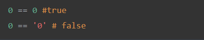 - Logical -Python has 3 logical operators like JavaScript but written in plain English instead of symbol `and or not` - Print to console - Python uses command `print()` - Other Syntax  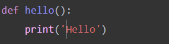 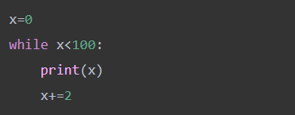 | - JavaScript has some arithmetic operators(`*`,`+`,`-`,`/`), we need to use methods of `Math` module for `floor` and `pow` . - JavaScript converts the two objects to the same type before performing the comparisons with `==` 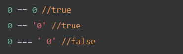 - JavaScript uses special character for comparing operators `&& || !` - JavaScript uses command `console.log()` - Other Syntax  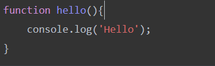 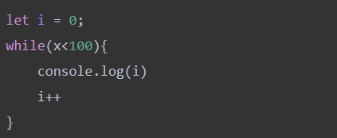 |
| Advantage          | - Python is very easy to learn as there are no complex syntax and rules as followed by another language. - Python is a platform-independent programming language as it can be run on any Operating system and some of them got python by default. - As  an interpreted language, Python would executed line by line which make it easier to debug. - Similar with embedding YouTube video code into HTML code, Python can be embed in other programming language like C++ - Python is extensible which mean it interface Python with libraries written in other languages such C++. - Not only running the program, GUI solutions is also provided with build in toolkit such as tkinter which allow create GUI applications fast and easy. | - Inspired by Java, JavaScript is relatively simple to learn and implement especially when it come to front end development. -  - Developed to support client side, JavaScript can be run immediately within the browser and unhindered by network calls to a backend server - Unlike PHP or other scripting languages, JavaScript can be inserted into any web page or different kinds of applications due to its support in other languages such Pearl, PHP - As the client-side focus, JavaScript can reduces the demand on servers and even allow serverless application to operate. Furthermore, data validation is possible on the browser itself rather than sending it off the server for handling. - JavaScript provides various interfaces to developer for creating beautiful website with functionality and many UI/UX components. |
| Disadvantage       | - While relatively easy to debug, as Python interpreter and execute code line by line, it is much slower comparing to C or  C++. - Due to flexible structure for data, Python will consume a large portion of memory during run time - As a strong-type language, Python would be the best language for server-side coding but when it comes to mobile development, we hardly see any application run on Python | - Since JavaScript code is viewable to the user, it can be use for malicious purposes such code injection, bypassing authentication. - JavaScript can be interprets differently between browser and platforms making any changes and improvements time consuming. - Debugging JavaScript is also troublesome as the code only show error during run time unlike C or C#.  |

source:

- https://data-flair.training/blogs/advantages-disadvantages-javascript/
- https://kcpelearning.com/showcourse/python3/strengths-and-weaknesses

## Reference

- Wasserman, Adam. “The Philosophies of Languages, from Java to JavaScript.” Accessed October 20, 2021. https://www.welcometothejungle.com/en/articles/philosophies-software-languages-javascript.
- “Strengths and Weaknesses of Python.” Accessed October 13, 2021. https://kcpelearning.com/showcourse/python3/strengths-and-weaknesses.
- Navone, Estefania. “Python VS JavaScript – What Are the Key Differences Between The Two Popular Programming Languages?” freeCodeCamp.org, January 28, 2021. https://www.freecodecamp.org/news/python-vs-javascript-what-are-the-key-differences-between-the-two-popular-programming-languages/.
- Koubbi, Rhita. “Python 2 vs Python 3: Which One You Should Learn.” Career Karma, July 14, 2020. https://careerkarma.com/blog/python-2-vs-python-3/.
- DataFlair. “Pros and Cons of JavaScript - Weigh Them and Choose Wisely!,” February 25, 2019. https://data-flair.training/blogs/advantages-disadvantages-javascript/.
- Gupta, Ayush. “Advantages and Disadvantages of JavaScript.” Accessed October 13, 2021. https://www.tutorialspoint.com/advantages-and-disadvantages-of-javascript.
- Python.org. “PEP 20 -- The Zen of Python.” Accessed October 20, 2021. https://www.python.org/dev/peps/pep-0020/.
- Python.org. “PEP 8 -- Style Guide for Python Code.” Accessed October 12, 2021. https://www.python.org/dev/peps/pep-0008/.
- “Pip (Package Manager).” In *Wikipedia*, August 19, 2021. https://en.wikipedia.org/w/index.php?title=Pip_(package_manager)&oldid=1039503966.
- “About Npm | Npm Docs.” Accessed October 26, 2021. https://docs.npmjs.com/about-npm.
- “Npm (Software).” In *Wikipedia*, October 16, 2021. https://en.wikipedia.org/w/index.php?title=Npm_(software)&oldid=1050228343.
- DEV Community. “Which Is the Best IDE for JavaScript Development in 2021?” Accessed October 26, 2021. https://dev.to/theme_selection/what-is-the-best-ide-for-javascript-development-in-2021-1pmn.
- DEV Community. “Pycharm Vs Visual Studio Code [for Python Development].” Accessed October 26, 2021. https://dev.to/tabnine/pycharm-vs-visual-studio-code-for-python-development-4m15.
